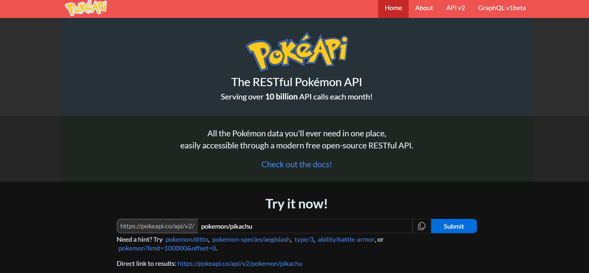
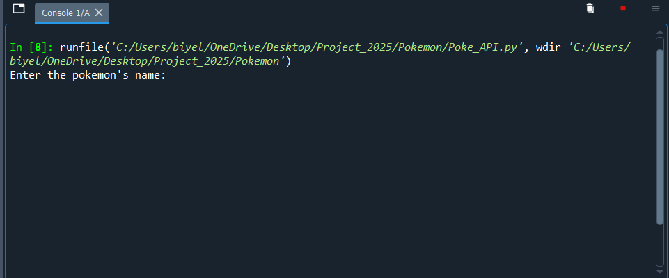
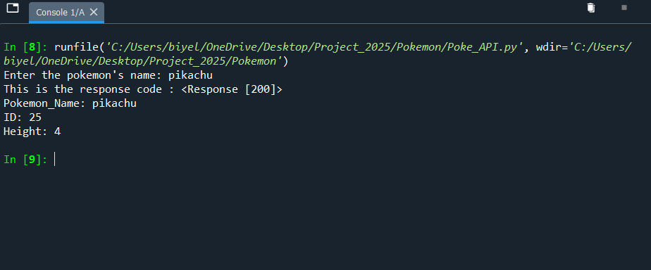

# Pokemon
 Learning more about APIs in Python by following a tutorial from YouTube on the Channel Bro Code. 
 See the link below:

 https://www.youtube.com/watch?v=JVQNywo4AbU

 NOTE: I added my own logic to the code so it is not exactlty like the code in the tutorial.

# Coding and PokeAPI
The API was made using Python and it fetches data from the url provided on the PokeAPI webiste. Visit the website using the link below:
https://pokeapi.co

Below is a screenshot of the PokeAPI landing webpage:

# How to use the API
the following are steps of what to do once you run the code

# STEP 1: Run the code and get an input prompt
you will have to run the code and get an input prompt where you will type in the name of the pokemon you want to receive information about.
This is what you should see after you run the code:

# STEP 2: Type in the name of the pokemon.

# Result
The expected result should look something like this

